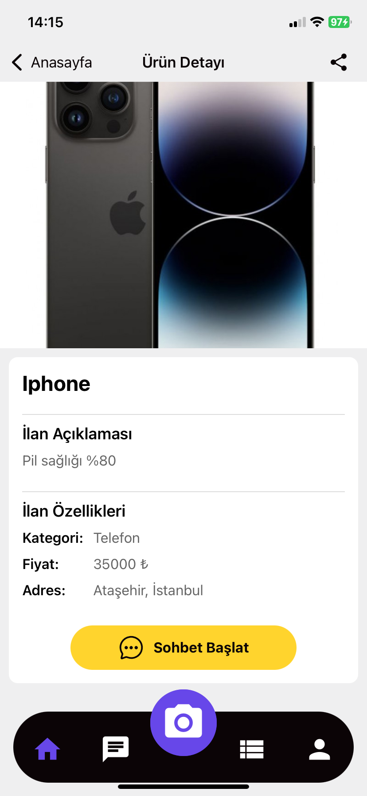
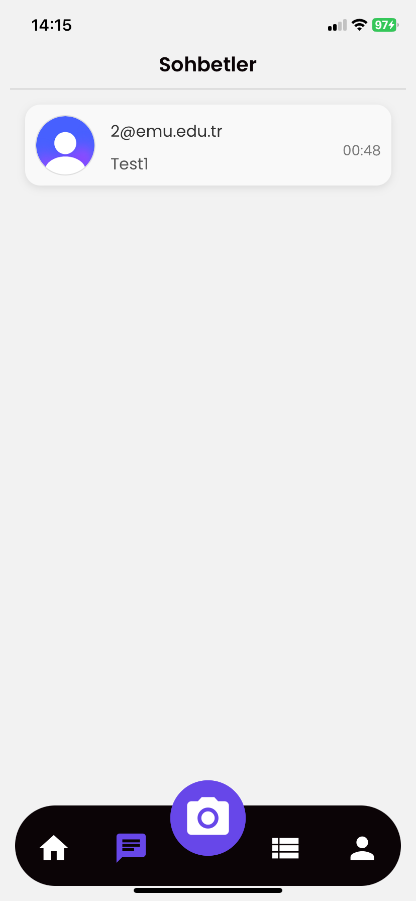
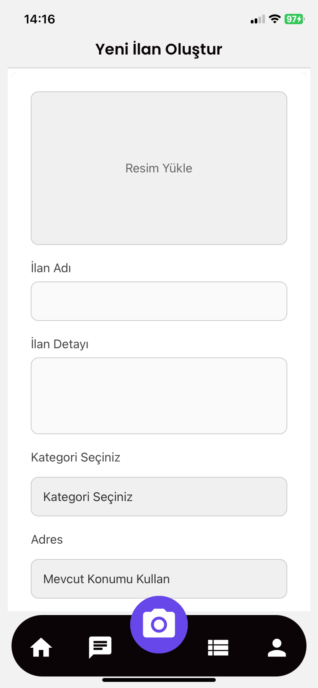
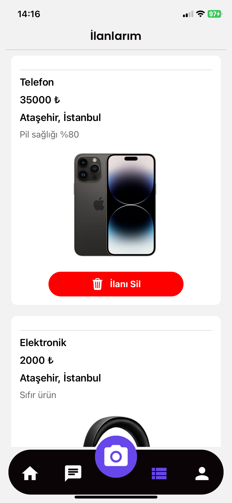
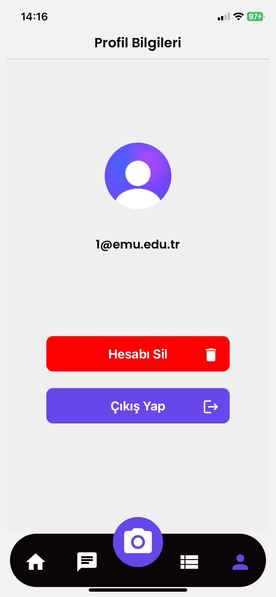

<div align="center">
    <picture>
      
    </picture>
  <h1>
    Uni Market
  </h1>
  
</div>

## Introduction

The **Uni Market** is a mobile application developed to provide a secure and exclusive platform for university students to buy and sell products within their campus community. This app is built using Expo, Clerk, and Firebase for a seamless and robust user experience.

### Project Features

- **Secure Authentication**: Only verified university students can access the app using Clerk-powered authentication.
- **Product Listings**: Users can create, edit, and manage their product listings with detailed descriptions and images.
- **Chat Functionality**: A real-time chat system enables secure and direct communication between buyers and sellers.
- **Firebase Integration**: Reliable and scalable database management for storing user data, product information, and chat messages.
- **Mobile-First Design**: Optimized for a seamless experience on mobile devices with an intuitive user interface.

## App Screenshots

### Entrance


### Sign Up


### Sign In


### Home


### Product Detail



### Chat


### Inbox



### Add Product



### My Products



### Profile



## Installation

To clone the repository, run the following command:

```bash
git clone https://github.com/your-username/university-student-marketplace.git
```

To run the application locally, follow these steps:

1. **Sign up for a Clerk account** at [Clerk](https://dashboard.clerk.com/sign-up).

2. **Set up Firebase**:
   - Go to the [Firebase Console](https://console.firebase.google.com/) and create a project.
   - Download the required Firebase configuration files and place them in the project.

3. **Install dependencies**:
   ```bash
   cd uni-market
   npm install
   ```

4. **Configure the environment variables** using the `.env.example` file.

5. **Configure the firebase** using the `firebaseConfig.tsx` file.

6. **Start the development server**:
   ```bash
   npm expo start
   ```

## Learn more

For detailed instructions and additional resources, check out the following links:

- [Expo Documentation](https://docs.expo.dev/)
- [Clerk Documentation](https://clerk.com/docs/)
- [Firebase Documentation](https://firebase.google.com/docs/)

## Contact

Burhanettin Kabak
For any questions or feedback, please contact me at [kabakburhanettin@gmail.com](mailto:kabakburhanettin@gmail.com).
Linkedin: [Burhanettin Kabak](https://www.linkedin.com/in/burhanettin-kabak-5aab731a4/)
