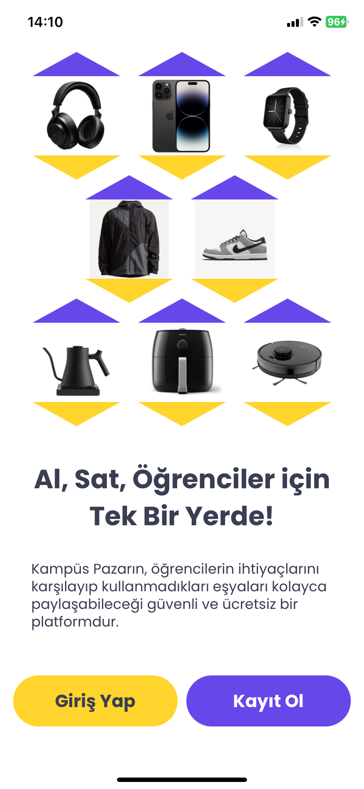
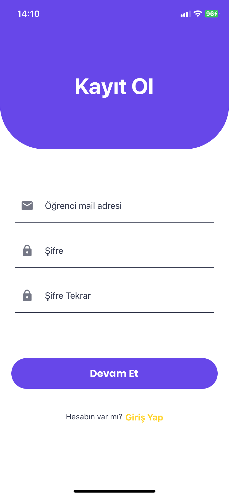
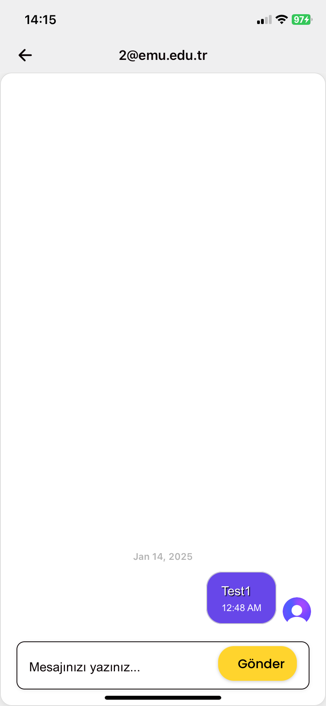

<style>
  .gallery {
    display: grid;
    grid-template-columns: repeat(auto-fit, minmax(120px, 1fr));
    gap: 15px;
    max-width: 600px;
    margin: auto;
    text-align: center;
  }
  .gallery-item img {
    width: 100%;
    max-width: 120px;
    border-radius: 8px;
    box-shadow: 0px 4px 6px rgba(0, 0, 0, 0.1);
  }
  .gallery-item b {
    display: block;
    margin-top: 5px;
    font-size: 14px;
  }
</style>

<div align="center">

  <h1>
    Uni Market
  </h1>
  
</div>

## Introduction

The **Uni Market** is a mobile application developed to provide a secure and exclusive platform for university students to buy and sell products within their campus community. This app is built using Expo, Clerk, and Firebase for a seamless and robust user experience.

### Project Features

- **Secure Authentication**: Only verified university students can access the app using Clerk-powered authentication.
- **Product Listings**: Users can create, edit, and manage their product listings with detailed descriptions and images.
- **Chat Functionality**: A real-time chat system enables secure and direct communication between buyers and sellers.
- **Firebase Integration**: Reliable and scalable database management for storing user data, product information, and chat messages.
- **Mobile-First Design**: Optimized for a seamless experience on mobile devices with an intuitive user interface.

## App Screenshots


<div class="gallery">
  <div class="gallery-item">
    
    <b>Entrance</b>
  </div>
  <div class="gallery-item">
    
    <b>Sign Up</b>
  </div>
  <div class="gallery-item">
    
    <b>Sign In</b>
  </div>
  <div class="gallery-item">
    
    <b>Home</b>
  </div>
  <div class="gallery-item">
    
    <b>Product Detail</b>
  </div>
  <div class="gallery-item">
    
    <b>Chat</b>
  </div>
  <div class="gallery-item">
    
    <b>Inbox</b>
  </div>
  <div class="gallery-item">
    
    <b>Add Product</b>
  </div>
  <div class="gallery-item">
    
    <b>My Products</b>
  </div>
  <div class="gallery-item">
    
    <b>Profile</b>
  </div>
</div>


## Installation

To clone the repository, run the following command:

```sh
git clone https://github.com/burhanettinkabak/uni-market.git
```

To run the application locally, follow these steps:

1. **Sign up for a Clerk account** at [Clerk](https://dashboard.clerk.com/sign-up).

2. **Set up Firebase**:
   - Go to the [Firebase Console](https://console.firebase.google.com/) and create a project.
   - Download the required Firebase configuration files and place them in the project.

3. **Install dependencies**:
   ```sh
   cd uni-market
   npm install
   ```

4. **Configure the environment variables** using the `.env.example` file.
   ```js
   EXPO_PUBLIC_CLERK_PUBLISHABLE_KEY=your_clerk_publishable_key
   ```
5. **Configure the firebase** using the `firebaseConfig.tsx` file.
  ```js
  const firebaseConfig = {
  apiKey: "Your Firebase API Key",
  authDomain: "Your Firebase Auth Domain",
  projectId: "Your Firebase Project ID",
  storageBucket: "Your Firebase Storage Bucket",
  messagingSenderId: "Your Firebase Messaging Sender ID",
  appId: "Your Firebase App ID",
  measurementId: "Your Firebase Measurement ID"
  };
  ```
6. **Start the development server**:
   
   ```sh
   npm expo start
   ```

## Learn more

For detailed instructions and additional resources, check out the following links:

- [Expo Documentation](https://docs.expo.dev/)
- [Clerk Documentation](https://clerk.com/docs/)
- [Firebase Documentation](https://firebase.google.com/docs/)

## Contact

Burhanettin Kabak

For any questions or feedback, please contact me at [kabakburhanettin@gmail.com](mailto:kabakburhanettin@gmail.com).

Linkedin: [Burhanettin Kabak](https://www.linkedin.com/in/burhanettin-kabak-5aab731a4/)
